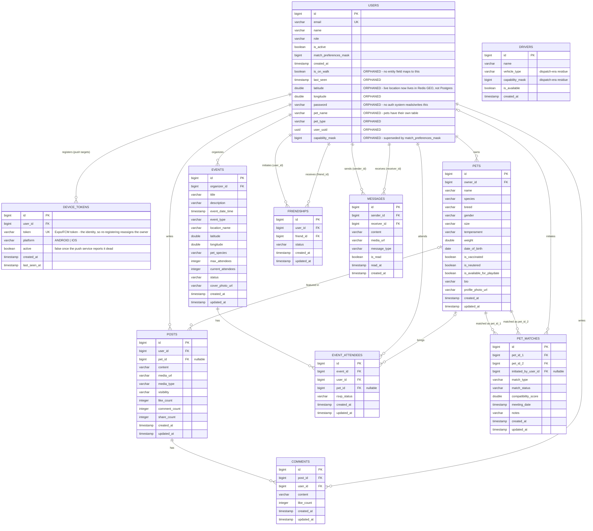
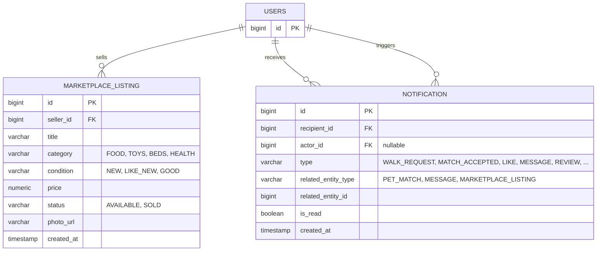

# ERD — Live Database State (2026-06-16)

This reflects the actual current `pet_social_db` schema, introspected directly from Postgres
today — not the intended design in `DATABASE_SCHEMA.md`. Use this to spot drift between what's
documented, what's live, and what the PawPal prototype (`reff/pawpal.pdf`, see
[[pawpal-design-ia]] in memory) actually needs.

## Current live schema

`DRIVERS` has **no foreign keys in or out** — it's fully disconnected from the rest of the graph,
confirming it's pure leftover. No Java entity maps to it anymore.

## Proposed additions (not implemented — from the PawPal prototype review)

`PET_MATCHES` is strictly pairwise (`pet_id_1`/`pet_id_2`) — it can't represent the prototype's
"2 spots left" group-walk invitations. If that's needed, it'd follow the same pattern already
used for `EVENTS`/`EVENT_ATTENDEES`: a `WALK_INVITATION` host entity plus a `WALK_PARTICIPANT`
join table, rather than forcing it into `PET_MATCHES`. Not drawn here pending the open question
in memory ([[pawpal-design-ia]]) about whether Walk and Blind Date should stay unified under
`PET_MATCHES` or split apart.

## Summary of drift to resolve

| Item | State |
|---|---|
| `drivers` table | Orphaned, safe to drop (no FKs, no entity) |
| 9 `users` columns | Orphaned, safe to drop (confirmed unused in code) |
| Marketplace | No entity exists — needs `MARKETPLACE_LISTING` (+ buyer/seller messaging) |
| Notifications | No entity exists — needs `NOTIFICATION` |
| Group walk invitations | `PET_MATCHES` can't model "N spots" — needs design decision |
| `MESSAGES` context | No FK to the `PET_MATCH`/listing a thread belongs to — open question |